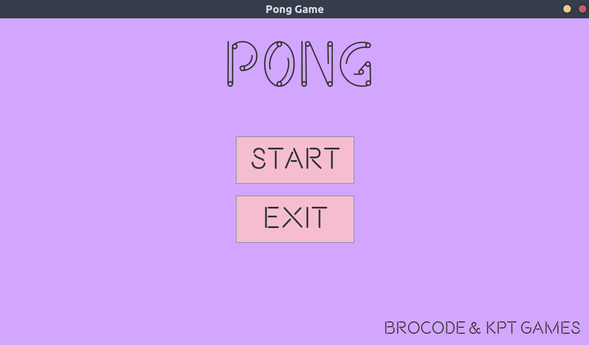
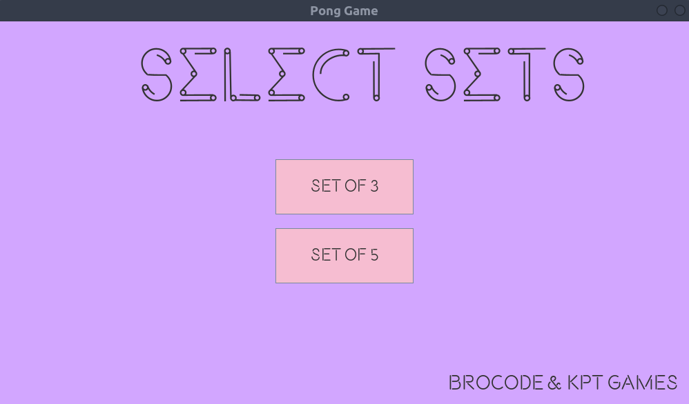
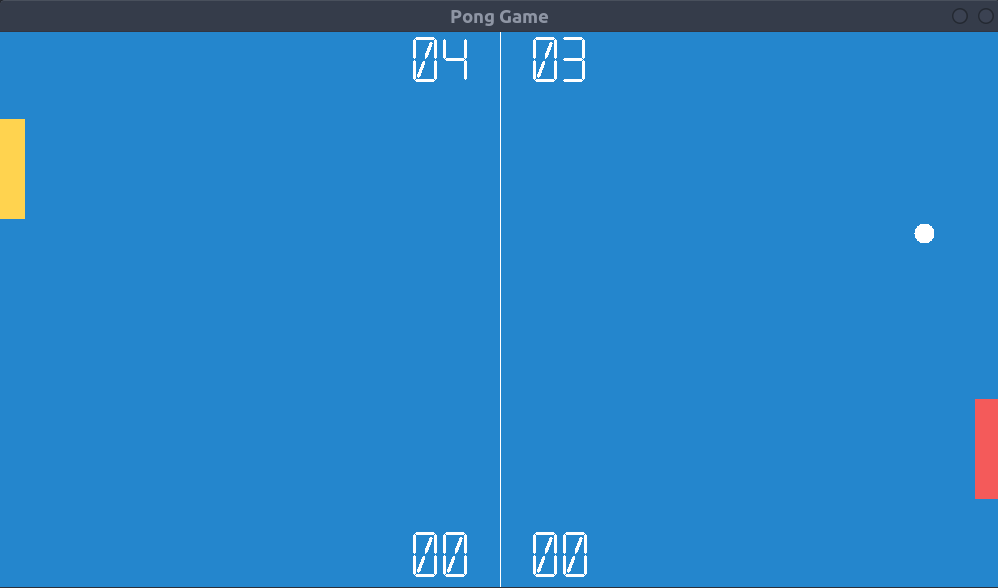
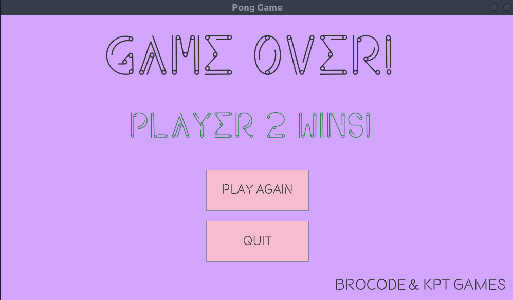

# Pong
A simple Pong Game copied from the Youtube Channel BroCode, for learning it. With some changes of my own. This is the first Project, and the first Game that I Learnt to make with Java. Was Pretty Fun. 

# Screenshots

# Credits
[Bro Code](https://www.youtube.com/c/BroCodez) for literally writing the code, I just copied the Main Thing, and Added features from my side like menus, options, sets and Score screen.  
Helped me a lot to understand the working of such games with Swing. 
